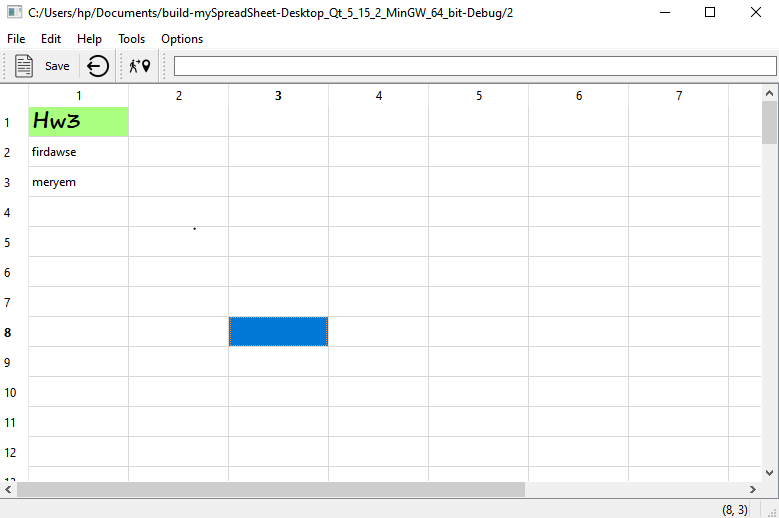
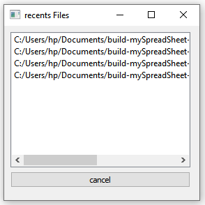
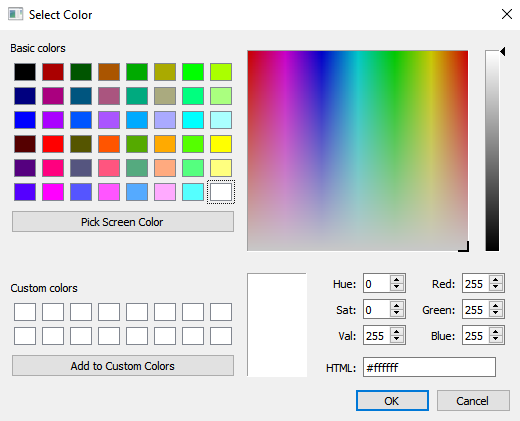
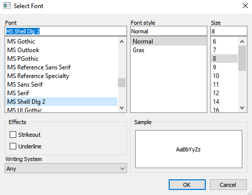
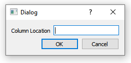
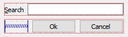
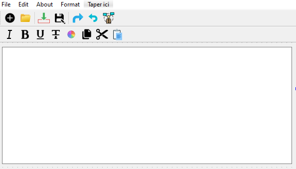

Application Using Main Window
================  
In this practical course we will be familiar with creating **main windows** using Qt. By the end, we will be able to build an application’s **entire** user interface, complete with menus, toolbars, status bar and as many dialogs as the application requires

## Table of Contents

- [SpreadSheet (Functionality)]()

  - [Context](#context)
  - [Saving Content](#SavingContent)
  - [Load File](#load)
    - csv
    - simple file
  - [recentFiles](#recentfiles)
     - QListWidget
  - [updateLineEdit]()
  - [backgroundColor](#color)
  - [selectFont](#font)
  - [select](#select)
    - row
    - col
    - all
  - [new file](#new)
  - [updateStatusBar](#bar)
  - [delete](#delete)
  - [Go Cell](#gocell)
  - [findCell](#findcell)
- [Text Editor](#texteditor)
  - [File](#file)
    - [New]()
    - [Open]()
    - [Save]()
    - [Save as]()
  - [Edit](#file)
    - [copy]()
    - [cut]()
    - [paste]()
    - [redo]()
    - [undo]()
  - [format](#format)
    - [italic]()
    - [bold]()
    - [strikeout]()
    - [underline]()
    - [text backgound Color]()

Let's introduce some basics concepts !

## Introduction:

- A **main window** provides a framework for building an application's user interface. Qt has QMainWindow and its [related classes](https://doc.qt.io/qt-5/widget-classes.html#main-window-and-related-classes) for main window management. QMainWindow has its own layout to which you can add [QToolBar](https://doc.qt.io/qt-5/qtoolbar.html)s, [QDockWidget](https://doc.qt.io/qt-5/qdockwidget.html)s, a [QMenuBar](https://doc.qt.io/qt-5/qmenubar.html), and a [QStatusBar](https://doc.qt.io/qt-5/qstatusbar.html). The layout has a center area that can be occupied by any kind of widget. You can see an image of the layout below.

  

* [**QTableWidget**](https://doc.qt.io/qt-5/qtablewidget.html#details)
  provide standard table display facilities for applications. The items in a QTableWidget are provided by QTableWidgetItem.

  

* [**QTableWidgetItem**](https://doc.qt.io/qt-5/qtablewidgetitem.html#details) :  
  Table items are used to hold pieces of information for table widgets. Items usually contain text, icons, or checkboxes

  The QTableWidgetItem class is a convenience class that replaces the QTableItem class in Qt 3. It provides an item for use with the QTableWidget class.

> Generally mainWindow are created using **Qt Designer**.

But for learning purposes, we will **code** the first example to demonstrate how it’s done by working on a **spreadsheet** Qt project to dicover all the underlying functionality! then creating a consistant textEditor using Qt designer

# Context[](#context)

In the lecture on **QMainWindow**,we wrote the code for the graphical and set of actions for our main SpreadSeet application. Now we will focus on writing a set of basic functionality.

at the end we will have an application that looks like that :



# Saving Files[](##SavingContent)

For this task, we will try to save the content of our spreadsheet in a simple format that stores the **coordinates** and the **content** of the non empty cells.

- We will start by writing a **private** function `saveContent(QSTring filename)` to save the content of our spreadsheet in a text file.

```c++
void  mySpreadSheet::saveContent(QString  filename)const
{
  QFile  file(filename);//pointeur  sur  un  fichier
  //ouvrir  le  fichier  en  mode  write
  if(!file.open(QIODevice::WriteOnly|QFile::Text)){
  QMessageBox::warning(spreadsheet,"warning","file  not  open");
  return;
  }
  QTextStream  out(&file);
  //Parcourir  les  cellules  et  sauvegarder
  int  rows  =  spreadsheet->rowCount();
  int  cols  =  spreadsheet->columnCount();
  for  (int  i=0;i<rows  ;i++){
  for  (int  j=0;j<cols  ;j++){
  auto  cell=spreadsheet->item(i,j);
  if(cell) {
  out<<  i  <<","<<j  <<","<<cell->text()  <<endl;
  }}}
  file.close();//fermer  le  fichier
}
```

As seen in the code above ,we will be using two classes:

- [QFile](https://doc.qt.io/qt-5/qfile.html) which provides an interface to read and write in files.
- [QTextStream](https://doc.qt.io/qt-5/qtextstream.html) for manipulating objects with a stream such as a file.
- Now that we have an operational `saveContent` function, we could focus on the slot itself.

```cpp
void  mySpreadSheet::saveSlot(){
    if(!currentFile){
  //Creer  Factory  design
  QFileDialog  D;  //factory
  auto  filename  =  D.getSaveFileName();
  currentFile  =  new  QString(filename);
  setWindowTitle(*currentFile);
  }
  saveContent(*currentFile); //sauvegarder  le  content
  };
```

# Loading Files[](#load)

Now ,let's try to load files`.csv` inside our QTableWidget
but first let's get an idea about this file type :

- CSV- A comma-separated values (CSV) file contains tabular data (numbers and text) in plain-text form. An Excel spreadsheet can be saved as a CSV file.  

    
  </br>

Let's code

```cpp
   void  mySpreadSheet::loadContent(QString  filename)const
  {
  QFile  file(filename);
  QFileInfo  fi(filename);
  if(fi.suffix()=="csv"){
  if  (  !file.open(QIODevice::ReadOnly)  )  {
  qDebug()  <<  "File  not  exists";
  }  else  {
  int  row=0;
  int  col=0;
  QTextStream  in(&file);
  //Reads  the  data  up  to  the  end  of  file
  while  (!in.atEnd())
  {
  QString  line  =  in.readLine();
  //  consider  that  the  line  separated  by  semicolons  into  columns
  for  (QString  item  :  line.split(","))  {
  spreadsheet->setItem(row,col,new  QTableWidgetItem(item));
  col++;
  }
  row++;
  }
  file.close();
  }
  }else{
  if(file.open(QIODevice::ReadOnly)){
  QTextStream  in(&file);
  QString  line;
  while(!in.atEnd()){
  line=  in.readLine();
  auto  tokens=line.split(QChar(','));
  auto  row  =  tokens[0].toInt();
  auto  col  =  tokens[1].toInt();
  spreadsheet->setItem(row,col,new  QTableWidgetItem(tokens[2]));
}}}}
```

our function can :

- load csv file :
  After finding the file extension using `suffix` method from `QFileInfo` class which provides system-independent file information
  each line is considered a row and each part separated by a comma is a column content
- load simple files that already contains the coordinates of each information below (row, column ,content)

> we 've used a QDebug class that it is useful to obtain a default QDebug object to use for writing debugging information. **we could have used QMessageBox** but why not learning new things

# Recents Files[](#recentfiles)

Now we will add the function for the **recentfiles** action. For that, let's implement a [QListWidget](https://doc.qt.io/qt-5/qlistwidget.html#details) on our project

- **QListWidget** is a convenience class that provides a list view similar to the one supplied by [QListView](https://doc.qt.io/qt-5/qlistview.html), but with a classic item-based interface for adding and removing items. QListWidget uses an internal model to manage each [QListWidgetItem](https://doc.qt.io/qt-5/qlistwidgetitem.html) in the list.

1- first thing to do is to save the filename of file each time we load it in an array of QString `files`

```c++
void mySpreadSheet::loadSlot(){

    QFileDialog D; //factory
    auto filename = D.getOpenFileName();

    files[count]=filename;
    count++;
```

2- Then Using the designer we obtain the following form  



3 - And here is the implementation of recentfiles constructor

```c++
recentfiles::recentfiles(QWidget  *parent,QString  *  files  )  :
  QWidget(parent),
  ui(new  Ui::recentfiles)
{
  ui->setupUi(this);
  for(int  i=0;i<5;i++){
  auto  item  =new  QListWidgetItem(files[i]);
  ui->listWidget->addItem(item);
  }
}
```

4- Now we are setup to create the **interesting** connexion between the **recent files** action:

```c++
  void  mySpreadSheet::recentFilesSlot(){
  auto  wid  =  new  QWidget();
  wid->show();
  wid->resize(280,250);
  wid->setWindowTitle("recents  Files");
  auto  recentFile  =  new  recentfiles(wid,files);
  recentFile->show();
}
```

# Line Edit [](#line)

In the the top of our table we've added a LineEdit that show the content of the current item

- here is the implementation of the updateLineEdit Slot

```c++
void mySpreadSheet::updateLineEdit()
{
   auto location = spreadsheet->currentItem();
               if(location )
formulaInput->setText(location->data(Qt::EditRole).toString());
               else
                   formulaInput->clear();
}
```

  # backgroundColor [](#Color)

Among the functonnalities that we've added ;changing the background of an item.

to do that we 've called

- The [QColor](https://doc.qt.io/qt-5/qcolor.html) class that provides colors based on RGB, HSV or CMYK values...



Here is the interesting connexion with the **backgroundColor** action:

```c++
void mySpreadSheet::backgroundColorSlot()
{
    QTableWidgetItem *item = spreadsheet->currentItem();
    QColor col = item ? item->background().color() : spreadsheet->palette().base().color();
    col = QColorDialog::getColor(col, this);
    if (!col.isValid())
        return;

    const QList<QTableWidgetItem *> selected = spreadsheet->selectedItems();
    if (selected.isEmpty())
        return;

    for (QTableWidgetItem *i : selected) {
        if (i)
            i->setBackground(col);
    }
}
```

> Our function not just changes the background Color of a single item but can also **consider a _selection of items_**

# Select font[](#font)

to improve the performance of our application, we thought about modifying the font of items by using the power of [QFont](https://doc.qt.io/qt-5/qfont.html) class that specifies a query for a font used for drawing text.  



the same process of calor selector is repeated

```c++
void mySpreadSheet::selectFont()
{
    const QList<QTableWidgetItem *> selected = spreadsheet->selectedItems();
    if (selected.isEmpty())
        return;

    bool ok = false;
    QFont fnt = QFontDialog::getFont(&ok, font(), this);

    if (!ok)
        return;
    for (QTableWidgetItem *i : selected) {
        if (i)
            i->setFont(fnt);
    }
}
```

# Select[](#select)

- ## column
  to select a desired row we have first ceated a dialog to get its location



then implemented our selectCol slot

```c++
 select f;
 auto reply =  f.exec(); //extraire le text
 auto col =f.getLoaction();
if(col <= 0) return;
spreadsheet->setSelectionMode(QAbstractItemView::SingleSelection);
spreadsheet->setSelectionBehavior(QAbstractItemView::SelectColumns);
spreadsheet->selectColumn(col.toInt()-1);
spreadsheet->setSelectionMode(QAbstractItemView::NoSelection);
```

as seen in the code above we have used :

- [QAbstractItemView](https://doc.qt.io/qt-5/qabstractitemview.html) class that provides the basic functionality for item view classes like

  - [setSelectionBehavior]()
    This property holds whether selections are done in terms of single items, rows or columns
  - [setSelectionMode]()This property controls whether the user can select one or many items and, in many-item selections, whether the selection must be a continuous range of items.

- ## row
  the same work of select column is repeated here the only change is the selection behavior

```c++
 select f;
auto reply =  f.exec();

//extraire le text
auto row =f.getLoaction();

if(row <= 0) return;
spreadsheet->setSelectionMode(QAbstractItemView::SingleSelection);
spreadsheet->setSelectionBehavior(QAbstractItemView::SelectRows);
spreadsheet->selectRow(row.toInt()-1);
spreadsheet->setSelectionMode(QAbstractItemView::NoSelection);
```

- ## All
  to select all the coloums and row all we need is to to catch the selectAll event in a QTableWidget

```c++
connect(all, &QAction::triggered,
           spreadsheet, &QTableWidget::selectAll);
```

# New File[](#new)

to create a new file , the task is easy , the currentFile as well as all the items should be empty

here is the concretization of that

```c++
void mySpreadSheet::newSlot(){
*currentFile="";
spreadsheet->clearContents();
}
```

# update status bar [](#status)

As we 've said in the introduction QMainWindow provides a main application window, with a menu bar, tool bars, dock widgets and a **status bar** which is an horizontal bar suitable for presenting status information

after setting up the the status bar

```c++
statusBar()->addPermanentWidget(cellLocation);
statusBar()->addPermanentWidget(cellFormula);
```

and connectting the chane of any element in the spreadsheet with the update status bar

```c++
connect(spreadsheet, &QTableWidget::cellClicked, this,&mySpreadSheet::updateStatusBar)
```

the updateStatusBar slot is quite simple

```c++
void mySpreadSheet::updateStatusBar(int row, int col)
{
QString cell{"(%0, %1)"};
cellLocation->setText(cell.arg(row+1).arg(col+1));
}
```

our status bar work perfectly

# delete [](#Delete)

deleting a single item doesn't require creating an action , but sometimes to deal with a set of adjacents items we need to facilatate the task through our delete slot where we assign an empty text to all the selected items

```c++
void mySpreadSheet::deleteSlot(){
  const QList<QTableWidgetItem *> selected = spreadsheet->selectedItems();
  if (selected.isEmpty())
      return;
  for (QTableWidgetItem *i : selected) {
      if (i)
          i->setText("");
  }
```

# Go Cell[](#go cell)

this action send you directly to the desired item by getting the location from user using a QDialog


validating the input using regular expression validator

```c++
//Validating the regular expression
 QRegExp regCell{"[A-Z][1-9][0-9]{0,2}"};

 //Validating the regular expression
 ui->lineEdit->setValidator(new QRegExpValidator(regCell));
```

then creating the action ,the connection and the implementation of goCellSlot

```c++
    Dialog D;
     auto reply =  D.exec();    //
    //verifier si le dialog a été accepté
     if(reply == Dialog::Accepted)
        {
         //extraire le text
         QString cell =D.getCell();
         //extraire la ligne
         int row = cell[0].toLatin1() -'A';
         //extraire la colonne
         cell =cell.remove(0,1);
         int col= cell.toInt()-1;
         //changer de cellule
         statusBar()->showMessage("changing the current cell",2000);
         spreadsheet->setCurrentCell(row,col);
     }
}
```

# find cell [](#find cell)

if goCell send you to the desired item through coordinates find cell will do the same task but based on a given text
for that we've used a QDialog


containing a public function `QString getCell()const;`
that return the lineEdit text

```c++
QString findDialog::getCell()const
{
return ui->lineEdit->text();
}
```

then the interesting implementation of find cell Slot which tries to find the element matching the given text

```c++
void mySpreadSheet::findCell(){
    findDialog f;
     auto reply =  f.exec();

     //extraire le text
     QString cell =f.getCell();
     int rows = spreadsheet->rowCount();
     int cols = spreadsheet->columnCount();

     for (int i=0;i<rows ;i++){
        for (int j=0;j<cols ;j++){
           auto location = spreadsheet->item(i,j);
           if(location && location->text()==cell){
               spreadsheet->setCurrentCell(i, j);
               return;
        }}}
}
```

### *Our spreadsheet is working smothly* let's move to another application  
  
</br>

Text Editor [](#textEditor)
================  
For this example, we will be creating a simple text editor program built around QPlainText. we will be playing with the Designer for a fast application creation.  

  * [Qt Designer](https://doc.qt.io/qt-5/qtdesigner-manual.html) is the Qt tool for designing and building graphical user interfaces (GUIs) with Qt Widgets. You can compose and customize your windows or dialogs in a what-you-see-is-what-you-get (WYSIWYG) manner, and test them using different styles and resolutions.  


**here is an overview of our TextEditor**  



the creation of this form was easy enouph ,and funny at the same time 
* first we 've created an empty QMainWindow Project.
* Added a resource file and a set of predefined icons
* added all the menus in the image description
* added  actions to a menu by simply clicking the text in the menu.
* then the interesting part coding the functionalities of the Text Editor ,*let's do that together*


# File [](#File)

* ## **New** :[](#New)
to renew our application we simply set an empty Text to the text edit 
``` c++
void texteditor::on_actionNew_triggered()
{
filename = "";
ui->textEdit->setText("");
}
```
* ## **Open** :[](#Open)
To get open a file we call the [QFileDialog](https://doc.qt.io/qt-5/qfiledialog.html) class that provides a dialog that allow users to select files or directories  

 if the file doesn't open a  warning messageBox is appearing 

then through 
[The QTextStream](https://doc.qt.io/qt-5/qtextstream.html) class that provides a convenient interface for reading and writing text we set the content of file in the TextEdit .
``` c++
void texteditor::on_actionOpen_triggered()
{
   QString path = QFileDialog::getOpenFileName(this,"open the file");
   QFile file(path);
   filename = path;
   if(!file.open(QFile::ReadOnly |QFile::Text)){
       QMessageBox::warning(this,"warning","file not open");
       return;
   }
   QTextStream in (&file);
   QString text =in.readAll();
   ui->textEdit->setText(text);
   file.close();
}
``` 
* ## **Save as** :[](#saveas)
To `save as` a file  we first, get save the file name ,make sure the file is open perfectly 
then convert the content of our textEdit to a plain text then provide an interface to write it using **QTextStream**

``` c++
void texteditor::on_actionSave_as_triggered()
{
    QString path = QFileDialog::getSaveFileName(this,"open the file");
    QFile file(path);
    filename = path;
    if(!file.open(QFile::WriteOnly |QFile::Text)){
        QMessageBox::warning(this,"warning","file not open");
        return;
    }
    QTextStream out (&file);
    QString text =ui->textEdit->toPlainText();
    out << text ;
    file.flush();
    file.close();
 }
```
* ## **Save** :[](#sa)

the only difference between save and save as is to check if the filename already exist 

``` c++
{
void texteditor::on_actionSave_triggered()
    if(!filename){
    QString path = QFileDialog::getSaveFileName(this,"open the file");
    *filename = path;
    }

    QFile file(*filename);
    QTextStream out (&file);
    QString text =ui->textEdit->toPlainText();
    out << text ;
    file.flush();
    file.close();
```

# Edit [](#edit)
we haven't done a big effort on the edit menu because we've worded with the [Public Slot](https://doc.qt.io/qt-5/qtextedit.html#public-slots) of [QLineEdit](https://doc.qt.io/qt-5/qtextedit.html)
* ## **Copy** :
``` c++
void texteditor::on_actionCopy_triggered()
{
    ui->textEdit->copy();
}
```
* ## **Cut** :[](#cut)
``` c++
void texteditor::on_actionCut_triggered()
{
    ui->textEdit->cut();
}
```
* ## **Paste** :[](#paste)
``` c++
void texteditor::on_actionPaste_triggered()
{
    ui->textEdit->paste();
}
```
* ## **redo** :[](#redo)
``` c++
void texteditor::on_actionredo_triggered()
{
    ui->textEdit->redo();
}
```
* ## **undo** :[](#undo)
``` c++
void texteditor::on_actionundo_triggered()
{
    ui->textEdit->undo();
}
```
# Format [](#format)
In this part we have tried to apply some performance propreties to our text for that we needed to be familiar with some classes and public functions like :


* The [QTextCharFormat](https://doc.qt.io/qt-5/qtextcharformat.html) class that provides formatting information for characters 
* The [QTextCursor ](https://doc.qt.io/qt-5/qtextcursor.html)class which offers an API to access and modify QTextDocuments
* and its public function [mergeCharFormat](https://doc.qt.io/qt-5/qtextcursor.html#mergeCharFormat) taht Merges the cursor's current character format with the properties described by format modifier. If the cursor has a selection, this function applies all the properties set in modifier to all the character formats that are part of the selection.

* ## **Italic** :[](#italic)
to make the textCursor italic we refer to the function **setFontItalic**
If italic is true, sets the text format's font to be italic; otherwise the font will be non-italic
``` c++
void texteditor::on_actionItalic_triggered()
{
    QTextCharFormat format;
    format.setFontItalic(1);
    ui->textEdit->textCursor().mergeCharFormat(format);
}
```

* ## **Bold** :[](#bold)

to make the textCursor italic we refer to the function setFontWeight ,it sets the text format's font weight to bold.
``` c++
void texteditor::on_actionBold_triggered()
{
    QTextCharFormat format;
    format.setFontWeight(QFont::Bold);
    ui->textEdit->textCursor().mergeCharFormat(format);
}
```
* ## **underline** :[](#underline)
same here we use the fonction **setFontUnderline** ; If underline is true, sets the text format's font to be underlined; otherwise it is displayed non-underlined.
``` c++
void texteditor::on_actionunderline_triggered()
{
    QTextCharFormat format;
    format.setFontUnderline(1);
    ui->textEdit->textCursor().mergeCharFormat(format);
}
```
* ## **strikeout** :[](#strikeout)
and again to underline a text we use **setFontStrikeOut** ; If strikeOut is true, sets the text format's font with strike-out enabled (with a horizontal line through it); otherwise it is displayed without strikeout.
``` c++
void texteditor::on_actionstrikeout_triggered()
{
    QTextCharFormat format;
    format.setFontStrikeOut(1);
    ui->textEdit->textCursor().mergeCharFormat(format);
}
```
* ## **Background text color** :[](#bgcolor)
And.. this is a good part : setting a background color to a selected text  .

 After offering a QCalorDialog to select a color 
we  apply it to the background of cursor selection if no selection is done then it consider the word under cursor as selection    

here is the implementation of our slot 
``` c++
void texteditor::on_actiontext_Background_triggered()
{
    QColor col = QColorDialog::getColor(ui->textEdit->textBackgroundColor(), this);
    QTextCursor cursor = ui->textEdit->textCursor();
    if (!cursor.hasSelection()) {
        cursor.select(QTextCursor::WordUnderCursor);
        }
    QTextCharFormat fmt = cursor.charFormat();
    if (col.isValid()) {
        fmt.setBackground(col);
      } else {
        fmt.clearBackground();
        }
    cursor.setCharFormat(fmt);
    ui->textEdit->setCurrentCharFormat(fmt);
}
``` 
**We have managed to learn a lot from this lab ,hope you find it interesting !** 
